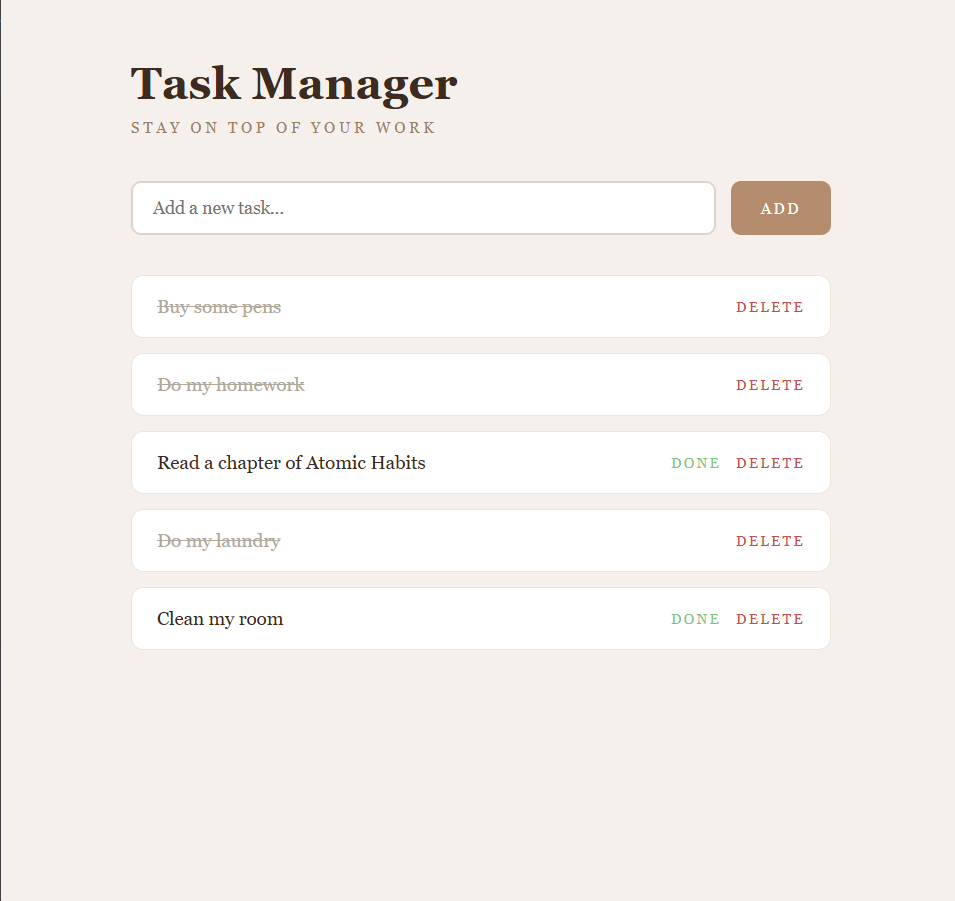

# Flask Task Manager

A full-stack task management web app built with Flask and Python. Add tasks, mark them complete, and delete them — all in a clean, minimal UI.

<p align="center">
  
</p>

## What it does

- Add tasks
- Mark tasks as complete
- Delete tasks
- Clean branded UI with Jinja2 templates

## Tech Stack

- Python 3
- Flask — web framework
- Jinja2 — HTML templating
- HTML/CSS — frontend

## Running Locally
```bash
python -m venv venv
venv\Scripts\activate
pip install flask
python app.py
```

Visit `http://127.0.0.1:5000`

## Key Concepts

- **Flask routing** — `@app.route()` for GET and POST requests
- **Jinja2 templating** — ``, `` in HTML
- **`request.form`** — reading data submitted from HTML forms
- **`redirect` and `url_for`** — redirecting after form submission
- **In-memory storage** — tasks stored in a Python list

## Author

**Omobolanle Sadela**  
[GitHub](https://github.com/bolanlesadela) · [LinkedIn](https://www.linkedin.com/in/omobolanle-sadela-7a486a1b4/)
